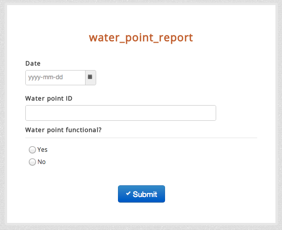
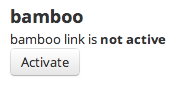
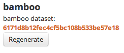
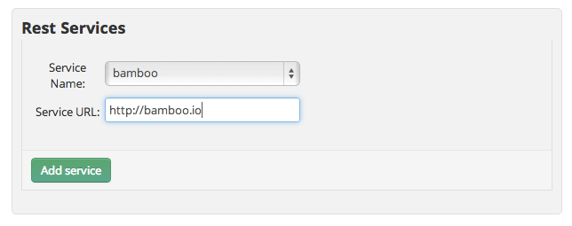
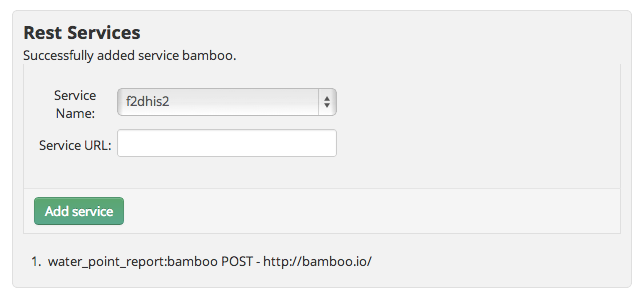

Broken Water Points
===================

In this example, we'll show you how bamboo with a mobile reporting platform like formhub could be used to help you monitor the functionality of water points.

Create the Water Point Report
~~~~~~~~~~~~~~~~~~~~~~~~~~~~~

First, let's create a very simple water report form using an XLSForm consisting of the following fields:

* **submit_date** - Date the water point was checked
* **wp_id** - Water point id
* **functional** - A boolean (yes/no) is the water point functional

Note: Please avoid naming any fields "date" or bamboo will mistake it with an internal date function.

Next, download `water_point_report.xls <http://formhub.org/mberg/forms/water_point_report/form.xls>`_ which is an XLSForm [#]_ representation of the form above and publish it to your `formhub <http://formhub.org>`_ account.  This will allow you to begin collecting data using this form via ODK Collect on your mobile or via a web-form.

Once you've published your form to formhub, you  click on the `webform link <http://pmywi.enketo.formhub.org/webform>`_ for **water_point_report** and enter some sample data.  Your webform should look like this.

For this example, let's imagine we have four water points labeled A-D.  Pick a date (say Jan 1st, 2013) and submit a report for each water point indicating whether it's functional or not.  Once you've done this, go back to your formhub account and you should see **4** submissions for the **water_point_report**.

Linking to bamboo
~~~~~~~~~~~~~~~~~

formhub provides some powerful ways to vizualize data but to generate dynamic indicators and for more advanced data analytics you will want to use `bamboo <http://bamboo.io>`_.

1. Goto the water_point_report form page and under bamboo click the **Activate** button. 

This automatically copies the data from the form in formhub into a resultant bamboo dataset.

To view the dataset you can `open <http://bamboo.io/datasets/6171d8b12fec4cf5bc108b533be57e18>`_ it in your browser or run the following curl command:

:: 

  curl http://bamboo.io/datasets/6171d8b12fec4cf5bc108b533be57e18

.. literalinclude:: water_points/json/wp1.json
   :language: javascript

To view a summary of the data run the summary command.  You can see that 3 of the water points are functional and one is broken.

:: 

  curl http://bamboo.io/datasets/6171d8b12fec4cf5bc108b533be57e18/summary?select=all

.. literalinclude:: water_points/json/wp1_summary.json
   :language: javascript

Creating indicators with aggregations and calculations
~~~~~~~~~~~~~~~~~~~~~~~~~~~~~~~~~~~~~~~~~~~~~~~~~~~~~~

Next let's combine aggregations and calculations to create indicators from the data.

First, using the count() aggregation to count the number of waterpoints.  This creates a new aggregated dataset where all aggregate calculations for the dataset will be stored.

::

  curl -X POST -d "name=waterpoints&formula=count()" http://bamboo.io/calculations/6171d8b12fec4cf5bc108b533be57e18

Next, we'll create a similar aggregation this time counting the number of waterpoints that are functional.

::

  curl -X POST -d "name=waterpoints_functional&formula=count(functional in [\"yes\"])" http://bamboo.io/calculations/6171d8b12fec4cf5bc108b533be57e18

To find the id of the new resulting aggregated dataset

::

  curl http://bamboo.io/dataset/6171d8b12fec4cf5bc108b533be57e18/aggregations

Which returns the following.  "" implies there is no grouping.

::

  {"": "bcf2b2799cad47168f4fedcf63745a87"}

.. literalinclude:: water_points/json/wp0_agg1.json
   :language: javascript

On the new aggregated dataset, we'll add a calculation to calculate the percentage of functional water points. Note: the calculation is being applied to the new aggregated dataset and not the original dataset.

::

  curl -X POST -d "name=perc_wp_functional&formula=waterpoints_functional/waterpoints" http://bamboo.io/calculations/bcf2b2799cad47168f4fedcf63745a87

The new calculation is now added to the aggregated dataset

.. literalinclude:: water_points/json/wp1_agg1.json
   :language: javascript

Monitoring water points over time
~~~~~~~~~~~~~~~~~~~~~~~~~~~~~~~~~

The challenge with monitoring water points is there status is not static.  Water points break and get fixed.  Being able to easily keep track of the individual and aggregate status of the water points as they change over time is where the real power of bamboo comes into play.

To allow for updates, we'll need to add the ability for formhub to update the dataset.  To do this on the water_points_report form page, we'll need to add a bamboo rest service.  Select "bamboo" from the pulldown and enter in http://bamboo.io into the Service URL

Click add service to establish the link.  The bamboo dataset (and all its derived aggregated sets) will now be automatically updated whenever a new form submission is received.

Now go back to the water points form and update the status of the water points a month later. In this case, I assumed water point A got fixed, B broke down, C remained open and the field team was unable to visit water point D (missing reporting).

.. literalinclude:: water_points/json/wp2.json
   :language: javascript

You can see that that functional summary is no longer helpful as it's a summary of water point reports and does not reflect the latest status of the waterpoints.

.. literalinclude:: water_points/json/wp2_summary.json
   :language: javascript

By applying a grouping on the dataset by water point id and then using the *newest* aggregation to return the newest functional status - the new resultant aggregated dataset will always represent the current functional status of all the water points.  Pretty cool! huh?

::

  curl -X POST -d "name=functional&formula=newest(submit_date,functional)&group=wp_id" http://bamboo.io/calculations/6171d8b12fec4cf5bc108b533be57e18

.. literalinclude:: water_points/json/wp_functional_summary.json
   :language: javascript

Recreating the aggregations and calculations we made earlier, this time on the new aggregated dataset, we are able to generate a summary of the status of the water points that will always be up to date. 

.. literalinclude:: water_points/json/functional.json
   :language: javascript

**Footnotes**

.. [#] XLSForm is a simple form standard that allows you to author simple to complex forms using excel. To learn more about XLSForm please visit: the `formhub.org/syntax <http://formhub.org/syntax>`_.

